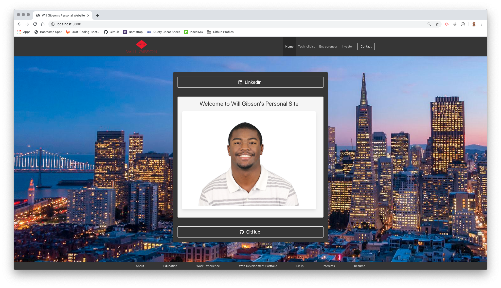
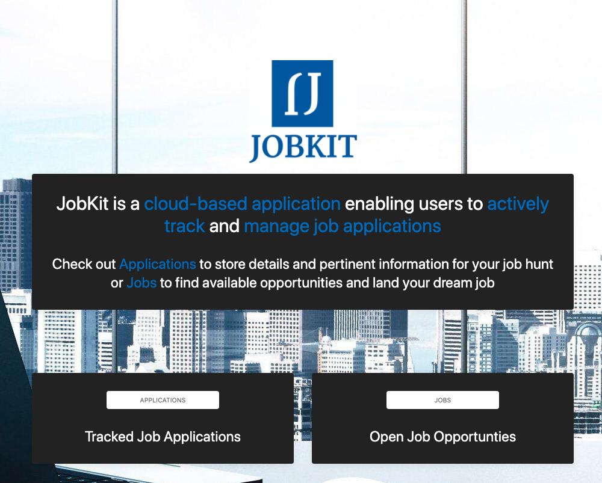

# Personal Portfolio

## Summary 

The purpose of the assignment was to create an updated portfolio site showcasing several assignments and projects (along with deployed page and Github repo links) developed throughout the program.

## Site Pictures


## Technologies Used
- HTML - used to create elements on the DOM
- CSS - styles HTML elements on page
- Bulma - CSS framework directed at responsive, mobile first front-end web development
- Git - version control system to track changes to source code
- GitHub - hosts repository that can be deployed to GitHub Pages

## Code Snippet

Below is an example of a block of HTML code leveraging the Bulma framework and its tile system to showcase one of my team projects.

```html
<article class="tile box is-child notification is-light">

    <p class="title has-text-dark">JobKit</p>

    <figure class="image is-4by3">
        <a href="https://job-kit.herokuapp.com/" target="_blank"></a>
    </figure>

    <br>

    <p class="subtitle has-text-dark is-invisible">Description</p>

    <br>

    <a href="https://github.com/wtgibson/job-kit" target="_blank" class="button">
    <span class="icon">
        <i class="fab fa-github"></i>
    </span>
    <span>GitHub</span>
    </a>

</article>
```

[Deployed Portfolio Page Site](https://wtgibson.github.io/personal-portfolio/)

[GitHub Project Repo](https://github.com/wtgibson/personal-portfolio)

## Author Links


Will Gibson

[LinkedIn](https://www.linkedin.com/in/wtgibson/)

[GitHub](https://github.com/wtgibson)